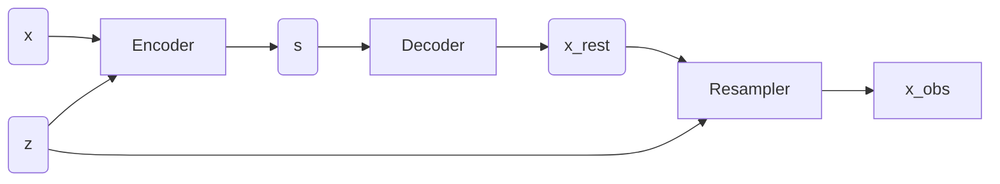

# Spectrum Encoder

Galaxy spectra have two fundamental degrees of freedom: their instrinsic spectral properties (or type, if you believe in such a thing), and their redshift.
Acknowledging the latter allows us to consrtuct a better model of the former. 
In our case, we express the instrinsic spectrum in restframe by an autoencoder, and apply an explicit redshift and resampling operation to map it onto the observed spectrum space:

